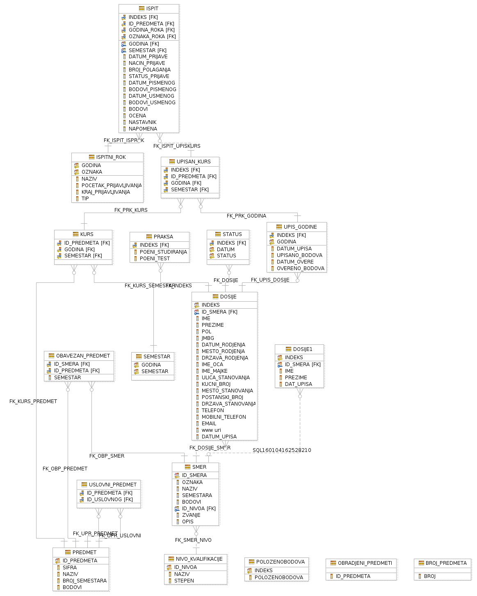

# Uverenja o diplomiranju

## :bookmark_tabs: Opis

Aplikacija prikazuje i štampa uverenje o diplomiranju, komunicira sa korisnikom preko panela unošenjem godine upisa studenta i njegovog broja indeksa. Proverava se da li je traženi student diplomirao - ukoliko jeste, korisniku se ispisuje uverenje o diplomiranju tog studenta i nudi mu se opcija da štampa uverenje u .txt datoteku, ukoliko nije, ispisuje se spisak nepoloženih predmeta.

Projekat je urađen kao seminarski rad iz predmeta Programiranje baza podataka na [Matematičkom fakultetu](http://www.matf.bg.ac.rs/).

## :tv: Demo
Panel za pretragu studenata
![demo1] (assets/demo_01_student_search.png)
Panel za ispisivanje uverenja o diplomiranju
![demo2] (assets/demo_02_graduation_certificate.png)
Panel za ispisivanje nepoloženih predmeta
![demo3] (/assets/demo_03_list_of_exams.png)

## :open_file_folder: Shema baze podataka

## :computer: Korisćene tehnologije
* Java (JDBC, Java Swing)
* SQL (DB2)

